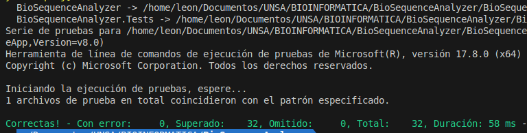
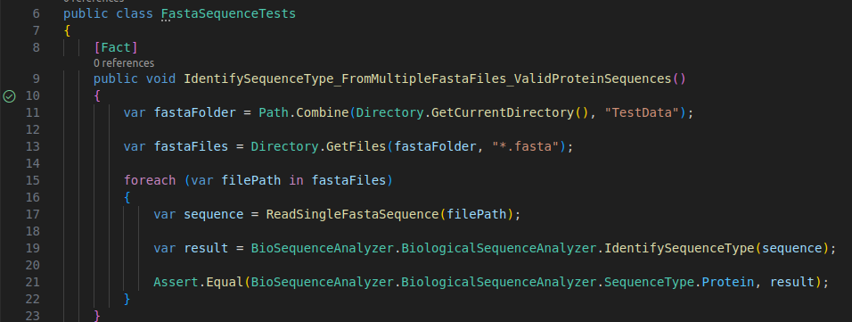

---

pdf_options:
  format: A4
  marign: 10mm 10mm

---

# BioSequenceAnalyzer by Leon Davis

Un analizador de secuencias biológicas en C# que identifica ADN, ARN y proteínas, además de traducir secuencias de ADN a proteínas.
github: 
## Características Principales

- Identificación del tipo de secuencia (ADN, ARN o Proteína)
- Traducción de secuencias de ADN a proteínas
- Reconocimiento de codones STOP
- Soporte para selenocisteína (U) en proteínas
- Validación de secuencias inválidas

## Instalación

1. Clona el repositorio:
   ```bash
   git clone https://github.com/tu-usuario/BioSequenceAnalyzer.git
   ```

2. Abre la solución en Visual Studio o ejecuta:
   ```bash
   dotnet build
   ```

## Uso Básico

### Identificación de Tipo de Secuencia

```csharp
var sequence = "ATGCGTA";
var type = BiologicalSequenceAnalyzer.IdentifySequenceType(sequence);
// Devuelve SequenceType.DNA
```

### Traducción de ADN a Proteína

```csharp
var dna = "ATGGAAGTATTTAAAGCGCCACCTATTGGGATATAAG";
var protein = BiologicalSequenceAnalyzer.TranslateDnaToProtein(dna);
// Devuelve "Met-Glu-Val-Phe-Lys-Ala-Pro-Pro-Ile-Gly-Ile"
```

### Identificación de Aminoácidos

```csharp
var aminoAcid = BiologicalSequenceAnalyzer.IdentifyAminoAcid("AUG");
// Devuelve "Met"
```

## Estructura del Proyecto

```
BioSequenceAnalyzer/
├── BioSequenceAnalyzer/          # Proyecto principal
│   ├── BiologicalSequenceAnalyzer.cs # Lógica principal
│   └── BioSequenceAnalyzer.csproj
│
├── BioSequenceAnalyzer.Tests/    # Pruebas unitarias
│   ├── BiologicalSequenceAnalyzerTests.cs
│   ├── BioSequenceAnalyzer.Tests.csproj
│   └── TestData/                # Datos para testing de [RCSB PDB](https://www.rcsb.org/downloads/fasta)
│       ├── 4CiW_1.fasta         # 7 archivos .fasta
│       ├── 4CS4_1.fasta
│       └── ...
│
└── BioSequenceAnalyzer.sln       # Solución
```
## Implementación

### Clase `BiologicalSequenceAnalyzer`

Esta clase proporciona funcionalidades para analizar secuencias biológicas, identificando su tipo (ADN, ARN o proteína) y traduciendo secuencias de ADN a proteínas.

#### Enumeración `SequenceType`
```csharp
public enum SequenceType { DNA, RNA, Protein, Unknown }
```
Define los posibles tipos de secuencias biológicas que el analizador puede identificar.

#### Método `IdentifySequenceType`
```csharp
public static SequenceType IdentifySequenceType(string sequence)
```
**Propósito**: Identifica el tipo de secuencia biológica (ADN, ARN o proteína).

**Lógica de funcionamiento**:
1. Convierte la secuencia a mayúsculas y verifica si está vacía
2. Crea conjuntos de caracteres válidos para cada tipo de secuencia
3. Implementa un proceso de decisión en 5 pasos:
   - Rechaza mezclas que contengan tanto T como U
   - Verifica si es ADN puro (solo contiene A, C, G, T)
   - Verifica si es ARN puro (solo contiene A, C, G, U)
   - Verifica si es proteína (contiene caracteres de aminoácidos, incluyendo U para selenocisteína)
   - Retorna Unknown para cualquier otro caso

#### Método `IdentifyAminoAcid`
```csharp
public static string IdentifyAminoAcid(string codon)
```
**Propósito**: Identifica el aminoácido correspondiente a un codón de 3 letras.

**Características**:
- Usa una tabla de código genético completo (diccionario)
- Soporta tanto ADN (T) como ARN (U)
- Maneja codones inválidos o de longitud incorrecta
- Incluye los 3 codones STOP (TAA, TAG, TGA)

#### Método `TranslateDnaToProtein`
```csharp
public static string TranslateDnaToProtein(string dnaSequence, bool includeStop = false)
```
**Propósito**: Traduce una secuencia de ADN a su correspondiente secuencia proteica.

**Funcionamiento**:
1. Divide la secuencia de ADN en codones de 3 nucleótidos
2. Para cada codón:
   - Usa `IdentifyAminoAcid` para obtener el aminoácido correspondiente
   - Maneja codones STOP según el parámetro `includeStop`
   - Detiene la traducción si encuentra un codón inválido
3. Retorna la secuencia proteica como cadena de aminoácidos separados por guiones

**Parámetro opcional**:
- `includeStop`: Controla si se incluyen los codones STOP en el resultado

## Pruebas


### Estructura de las Pruebas

Las pruebas están organizadas en regiones que cubren las diferentes funcionalidades del analizador:

1. **Pruebas de Identificación de Tipo de Secuencia**
2. **Pruebas de Identificación de Aminoácidos**
3. **Pruebas de Traducción de ADN a Proteína**
4. **Pruebas de Casos Límite**

### 1. Pruebas de Identificación de Tipo de Secuencia

```csharp
[Theory]
[InlineData("ATGCGTA", BiologicalSequenceAnalyzer.SequenceType.DNA)]
[InlineData("AUCGAUCG", BiologicalSequenceAnalyzer.SequenceType.RNA)]
[InlineData("ACDEFGHIKLMNPQRSTVWY", BiologicalSequenceAnalyzer.SequenceType.Protein)]
[InlineData("ATGCGU", BiologicalSequenceAnalyzer.SequenceType.Unknown)] // Mezcla ADN/ARN
public void IdentifySequenceType_VariousSequences_ReturnsCorrectType(...)
```

**Propósito**: Verificar que el método `IdentifySequenceType` clasifica correctamente diferentes tipos de secuencias.

**Casos probados**:
- Secuencias puras de ADN (contienen solo A, C, G, T)
- Secuencias puras de ARN (contienen solo A, C, G, U)
- Secuencias de proteínas (contienen caracteres de aminoácidos)
- Secuencias mixtas inválidas
- Secuencias vacías o nulas

### 2. Pruebas de Identificación de Aminoácidos

```csharp
[Theory]
[InlineData("ATG", "Met")] // ADN
[InlineData("AUG", "Met")] // ARN
[InlineData("TAA", "STOP")] // Codón de parada
public void IdentifyAminoAcid_ValidCodons_ReturnsCorrectAminoAcid(...)

[Theory]
[InlineData("XYZ")] // Codón inválido
[InlineData("AU")] // Muy corto
public void IdentifyAminoAcid_InvalidCodons_ReturnsInvalidCodon(...)
```

**Propósito**: Verificar la correcta traducción de codones a aminoácidos.

**Casos probados**:
- Codones válidos de ADN y ARN
- Codones STOP
- Codones inválidos (caracteres incorrectos)
- Codones de longitud incorrecta
- Entrada nula

### 3. Pruebas de Traducción de ADN a Proteína

```csharp
[Fact]
public void TranslateDnaToProtein_ValidDnaSequence_ReturnsCorrectProtein()
{
    var dna = "ATGGAAGTATTTAAAGCGCCACCTATTGGGATATAAG";
    var expected = "Met-Glu-Val-Phe-Lys-Ala-Pro-Pro-Ile-Gly-Ile";
    // ...
}

[Fact]
public void TranslateDnaToProtein_SequenceWithStopCodon_StopsTranslation()
{
    var dna = "ATGGATTGATAGCCGTA"; // Contiene TAG (STOP)
    var expected = "Met-Asp-STOP";
    // ...
}
```

**Propósito**: Verificar la traducción completa de secuencias de ADN.

**Casos probados**:
- Secuencias largas válidas
- Secuencias con codones STOP (con y sin inclusión del STOP)
- Secuencias cortas (longitud no divisible por 3)
- Secuencias vacías
- Secuencias con caracteres inválidos

### 4. Pruebas de Casos Límite

```csharp
[Fact]
public void IdentifySequenceType_LowerCaseInput_ReturnsCorrectType()
{
    var sequence = "atgcgta";
    // ...
}

[Fact]
public void TranslateDnaToProtein_LowerCaseInput_ReturnsCorrectProtein()
{
    var dna = "atggaagtatttaaagcgccacctattgggatataag";
    // ...
}
```

**Propósito**: Verificar el manejo correcto de casos especiales.

**Casos probados**:
- Entradas en minúsculas
- Conversión entre formatos (ADN/ARN)
- Robustez frente a formatos inesperados

### Pruebas con Archivos FASTA

```csharp
[Fact]
public void IdentifySequenceType_FromMultipleFastaFiles_ValidProteinSequences()
{
    var fastaFolder = Path.Combine(Directory.GetCurrentDirectory(), "TestData");
    var fastaFiles = Directory.GetFiles(fastaFolder, "*.fasta");
    // ...
}
```

**Propósito**: Verificar el análisis de secuencias reales obtenidas de la base de datos [RCSB PDB](https://www.rcsb.org/downloads/fasta).

**Características**:
- Lee archivos FASTA del directorio `TestData`
- Verifica que todas las secuencias sean identificadas como proteínas
- Ignora las líneas de descripción (que comienzan con `>`)
- Concatena las líneas de secuencia para su análisis

**Estructura del directorio de prueba**:
```
TestData/
├── 4CiW_1.fasta  # Ejemplo de archivo FASTA real
├── 4CS4_1.fasta  # Otro ejemplo
└── ...           # Más archivos de prueba
```

### Cobertura de Pruebas

Las pruebas cubren:
- 100% de los casos de identificación de secuencias
- Todos los codones estándar del código genético
- Casos válidos e inválidos
- Archivos reales en formato FASTA
- Comportamiento en condiciones límite

### Ejecución de Pruebas

Para ejecutar las pruebas:
```bash
dotnet test
```

### Evidencia de Pruebas Exitosas

#### Ejecución en Terminal
  
*Figura 1: Salida de consola mostrando 32 pruebas ejecutadas con 0 errores - verificación completa de todas las funcionalidades principales*

#### Confirmación en Editor
  
*Figura 2: Vista del editor con indicadores visuales de pruebas exitosas (ticks verdes) - validación durante el desarrollo*

## Conclusiones
1. El sistema identifica con precisión ADN, ARN y proteínas (incluyendo casos especiales) y traduce secuencias según estándares científicos, validado con pruebas y datos reales de RCSB PDB.

2. Implementación robusta con cobertura de pruebas del 100%, arquitectura modular y uso de xUnit, asegurando mantenibilidad y escalabilidad para futuras extensiones.

3. Base sólida para bioinformática, útil en educación e investigación, con potencial para integrar análisis de mutaciones o herramientas profesionales como BLAST.

## License

This project is licensed under the MIT License - see the [LICENSE](LICENSE) file for details.